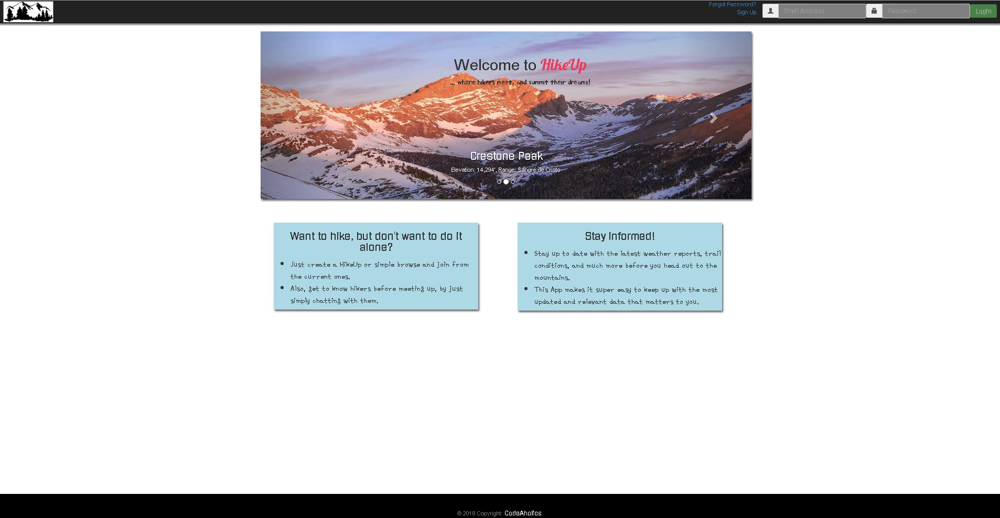
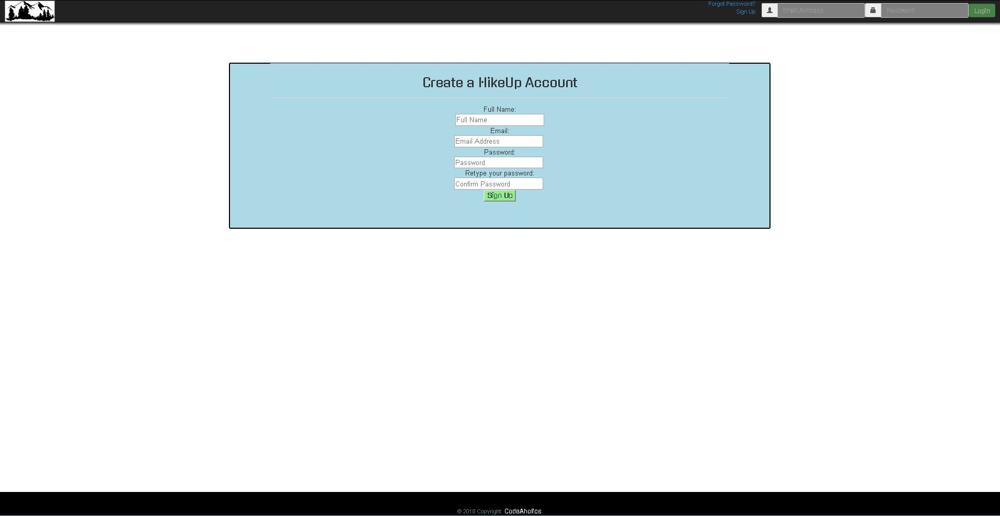
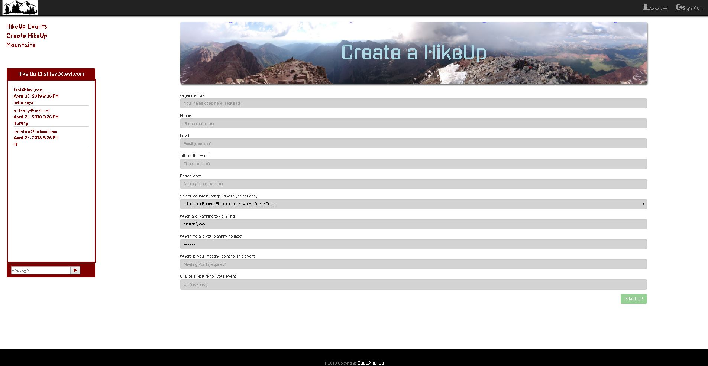

# HikeUp Hiking App (Project 3)
A hike-searching/hike-posting application that uses Node.js, MongoDB, Firebase DB(Authentication), ReactJS & Reactstrap.

## Description

This website demonstrates a full stack application with a front end implemented with a component based architecture from ReactJS & styling from Reactstrap's framework. The backend implemented with Node.js, Firebase and MongoDB.

The user is welcomed with the homescreen, which shows a little about the app itself, plus some miscellaneous content.

Then, the user can create his/her Login credentials by clicking on "SIGN UP". Once the new user's profile has been created, they can gain access to the full site and start using all of its functionlities (like "Create/View a HikeUp", "Chat with other hikers", view relevant up to date information about the mountain they want to summit, etc).

### Additional facts:

* The user can change his/her password through "My Account". User Data gets accessed on our Database and updated with the new password.

* On Create a HikeUp, the user can fill the input fields and create an event. Once this step is completed, this data will be saved in the database.

* Log out option (located on the username's drop-down menu), will destroy local session. And rediect to homepage.  

## Demo

The demo of this application can be found [here](https://hikeup-ajk.herokuapp.com/).

## Installation

To run the application locally, first clone this repository with the following command.

	git clone https://github.com/johonma88/hikeup.git
	
Access to the project's folder

	cd hikeup

Next, install the application dependencies in the main app and also inside the client's folder.

	npm install

Next, start your Mongo Service.

    mongod
    mongo    
	
Finally, run the node server locally.

	npm run client && node server.js

	
Now, open the local application at the URL: `http://localhost:3000/`.

**Thank you for checking out our work!**

